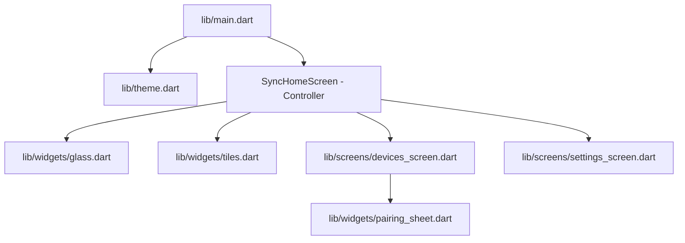

# Implementation Plan: AirBoard "Aurora" UI Integration

We will update the user interface of all AirBoard client apps (Linux, Windows, Android, and iPadOS/iOS) by replacing the legacy layout with the redesigned frosted glass "Aurora" styling. 

To maintain functionality, we will **preserve all background network syncing, E2EE key exchanges, MethodChannels, platform clipboard monitors, and Rust-bridge streams** while restructuring the UI layers into modular, clean, and maintainable files.

---

## Proposed Changes

We will split the monolithic `lib/main.dart` into a modular Flutter directory structure under `lib/`.

### 1. Style & Theme Tokens
#### [NEW] [theme.dart](file:///home/sanal-sivakumar/Documents/clipboard/lib/theme.dart)
*   Define the Liquid Glass design tokens (class `AB`): background canvas (`bg0`), accents (`accent`, `accent2`, linear gradients), semantic states (`ok`, `warn`, `danger`), frosted transparent colors (`glass`, `glassStrong`, `glassHi`), borders (`stroke`, `strokeHi`), shape border-radii (`rLg`, `rMd`, `rSm`), and Google Fonts Inter/JetBrainsMono typography schemas.

### 2. Frosted Containers & Custom Micro-interactions
#### [NEW] [glass.dart](file:///home/sanal-sivakumar/Documents/clipboard/lib/widgets/glass.dart)
*   `GlassCard`: Backdrop frosted-glass blur (sigma: 30) container with diagonal sheer glare, border stroke sheen, and drop shadows (supporting desktop hover-lift and event flash glows).
*   `AmbientBackground`: Animated builder running fluid radial blobs (`m1` blue, `m2` violet, `m3` teal) rotating in the background behind the glass sheets.
*   `PulseDot`: Pulsing green/gray/amber dot indicating pairing/active states.
*   `GlassToggle`: iOS-style toggle switches for Secure Sync settings.
*   `showGlassToast`: Floating glass snackbar replacement to confirm actions.

### 3. List Rows & Custom Components
#### [NEW] [tiles.dart](file:///home/sanal-sivakumar/Documents/clipboard/lib/widgets/tiles.dart)
*   `SectionTitle`: Categorized block title with optional count chip.
*   `StatusBadge`: Clickable pill badge for pairing status.
*   `DeviceTile`: Renders connected/discovered peers with device-type specific SVG icons and E2EE state tags.
*   `ClipTile`: Row rendering item content, type icon (Text, Link, Code), device origin, sync timestamp, and tap-to-copy trigger.

### 4. Zero-Trust Verification Modal
#### [NEW] [pairing_sheet.dart](file:///home/sanal-sivakumar/Documents/clipboard/lib/widgets/pairing_sheet.dart)
*   `showPairingSheetDialog`: Custom pairing confirmation modal presenting device properties and a structured 16-byte hex cryptographic fingerprint for zero-trust matching.

### 5. Screens & Tabs
#### [NEW] [devices_screen.dart](file:///home/sanal-sivakumar/Documents/clipboard/lib/screens/devices_screen.dart)
*   Merges discovered peers, trusted/paired peers, and local clipboard history lists into a single, unified scrollable panel.
*   Presents dynamic counts in a frosted top-level `_statusBar` section (Total Discovered, Paired, and E2EE status).
*   Maps manual connection IP input field.
*   Maintains a dynamic local clipboard history list updated in real-time.

#### [NEW] [settings_screen.dart](file:///home/sanal-sivakumar/Documents/clipboard/lib/screens/settings_screen.dart)
*   Provides text editor for Device Name and toggle switches for Sync.
*   Lists copyable network metrics: active LAN IP address, device UUID, last synchronization timestamp, and local identity fingerprint.
*   Appends a collapsible log console card to view system/E2EE events.

### 6. App Bootstrapper & Logic Controller
#### [MODIFY] [main.dart](file:///home/sanal-sivakumar/Documents/clipboard/lib/main.dart)
*   Simplify `main.dart` to contain only standard Flutter initialization, platform storage paths setup, Rust bridge subscriptions, and MethodChannel handlers.
*   `_SyncHomeScreenState` will act as the parent state coordinator. It will:
    1. Manage Rust streams and event queues.
    2. Maintain `_clipboardHistory` and automatically append incoming and local updates (mapping contents to Text, Link, or Code icons).
    3. Render the dynamic `AmbientBackground` and the responsive `HomeShell` layout (sidebar for desktop, bottom-nav for mobile).
    4. Feed active network variables, metrics, and logs directly to `DevicesScreen` and `SettingsScreen`.

---

## Verification Plan

### Automated Tests
- Run `flutter analyze` to ensure complete dart-level validation and package exports check.
- Run `cargo check` in `rust/` to verify Rust bindings compile cleanly.

### Manual Verification
- Launch the application: `flutter run -d linux`
- Verify responsive view scaling: resize the desktop window to check layout transition from desktop sidebar to mobile floating bottom nav.
- Validate copy-paste synchronization across devices and monitor real-time list updates on the redesign widgets.
