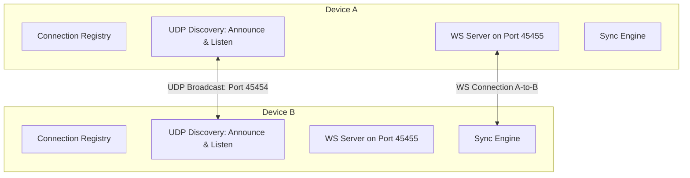

# Phase 2 Implementation Plan: Peer-to-Peer Clipboard Synchronization

This plan upgrades the Phase 1 client-server architecture to an automatic, multi-device Peer-to-Peer (P2P) clipboard synchronization system on local networks.

---

## 1. P2P Architecture Overview

Every device runs both a UDP Discovery service and a WebSocket Server, while dynamically spawning WebSocket Clients to connect to other discovered peers.



### Tie-Breaking for Duplicate Connections
To prevent A and B from concurrently opening connections to each other:
- We compare the `device_id` lexicographically.
- The peer with the **alphabetically smaller** `device_id` acts as the initiator (Client) and connects to the other peer's WebSocket server.
- The peer with the **alphabetically larger** `device_id` only listens for the incoming connection (Server).
- This ensures exactly **one** TCP/WS connection exists between any two devices.

---

## 2. Protocol Specifications

### UDP Device Announcement
Periodically broadcasted to `255.255.255.255:45454`:
```json
{
  "type": "device_announcement",
  "device_name": "device-name",
  "device_id": "uuid",
  "platform": "linux/android",
  "ws_port": 45455
}
```

### WS Clipboard Update
```json
{
  "type": "clipboard_update",
  "packet_id": "uuid",
  "origin_device_id": "uuid",
  "content": "clipboard text",
  "timestamp": 1712345678
}
```

### WS Heartbeat
Exchanged every 10–15 seconds over active connections:
```json
{
  "type": "heartbeat",
  "timestamp": 1712345678
}
```

---

## 3. Core Modules Design (Rust)

We will modify/create the following modules under `rust/src/core/`:

### 1. `core/discovery/`
- **Announcer**: Runs a loop sending a UDP announcement every 5 seconds.
- **Listener**: Listens on `0.0.0.0:45454`, parses incoming packets, and registers/updates peers.

### 2. `core/connection_registry/`
- Maintains a thread-safe registry of discovered peers and their statuses.
- Exposes registry details to Flutter so the UI can display active devices.

### 3. `core/peer_manager/`
- Manages the local WebSocket server.
- Coordinates client connections to discovered peers.
- Multi-peer routing: When a new clipboard packet is received, the peer manager updates the local clipboard (if valid) and forwards the packet to all other connected peers.

### 4. `core/reconnect/`
- Monitors inactive connections and attempts reconnects for peers that have been announced but are not connected.

### 5. `core/heartbeat/`
- Sends periodic heartbeats.
- Checks if a peer has not sent updates or heartbeats for >30 seconds, marking them dead and pruning them.

---

## 4. Proposed Changes

We will create and modify the following files:

### Rust Crate Configuration
- [MODIFY] [Cargo.toml](file:///home/sanal-sivakumar/Documents/clipboard/rust/Cargo.toml): Add/Verify tokio dependencies for UDP (`net`), and uuid.

### Rust Modules
- [MODIFY] [core/mod.rs](file:///home/sanal-sivakumar/Documents/clipboard/rust/src/core/mod.rs)
- [NEW] [core/discovery/mod.rs](file:///home/sanal-sivakumar/Documents/clipboard/rust/src/core/discovery/mod.rs)
- [NEW] [core/connection_registry/mod.rs](file:///home/sanal-sivakumar/Documents/clipboard/rust/src/core/connection_registry/mod.rs)
- [NEW] [core/peer_manager/mod.rs](file:///home/sanal-sivakumar/Documents/clipboard/rust/src/core/peer_manager/mod.rs)
- [NEW] [core/heartbeat/mod.rs](file:///home/sanal-sivakumar/Documents/clipboard/rust/src/core/heartbeat/mod.rs)
- [NEW] [core/reconnect/mod.rs](file:///home/sanal-sivakumar/Documents/clipboard/rust/src/core/reconnect/mod.rs)
- [MODIFY] [api/mod.rs](file:///home/sanal-sivakumar/Documents/clipboard/rust/src/api/mod.rs): Expose registry query and setup functions to Flutter.

### Flutter Code
- [MODIFY] [lib/main.dart](file:///home/sanal-sivakumar/Documents/clipboard/lib/main.dart): Revamp UI to display a list of connected devices, peer statuses, and a discovery active indicator.

---

## 5. Verification & Testing Plan

### Hotspot & Local LAN Testing
1. **Verification on Android Hotspot**:
   - Turn on Hotspot on Android.
   - Connect Linux laptop to the Android Hotspot.
   - Launch app on Android (starts UDP announce/listen + WS server).
   - Launch app on Linux (starts UDP announce/listen + WS server).
   - Both devices should auto-discover and establish a single WebSocket connection.
   - Copy text on either device and verify it propagates.
2. **Verification on WiFi LAN**:
   - Connect both devices to the same WiFi router.
   - Verify auto-discovery and synchronization.
