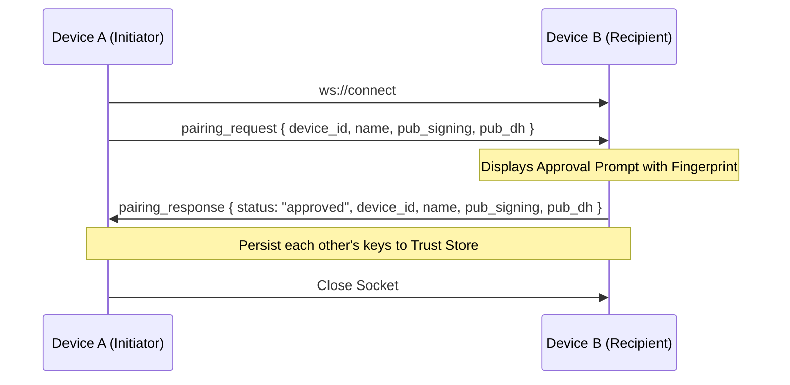
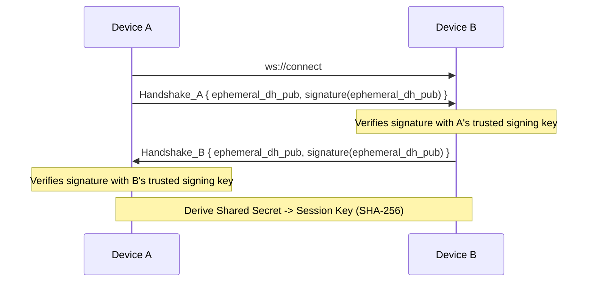

# Phase 3 Implementation Plan: Secure Pairing & E2E Encrypted Clipboard Sync

This plan upgrades the P2P clipboard sync system with cryptographic identities, trusted device storage, manual device pairing, and end-to-end (E2E) ChaCha20-Poly1305 payload encryption.

---

## 1. Cryptographic Architecture

### Cryptography Library Choice
To avoid complex C-library linking and cross-compilation errors on Android, we will use pure-Rust cryptography crates instead of native libsodium:
- `ed25519-dalek`: For Ed25519 identity signatures.
- `x25519-dalek`: For X25519 ephemeral Diffie-Hellman key exchange.
- `chacha20poly1305`: For ChaCha20-Poly1305 authenticated encryption.
- `rand`: For secure random generation.

### Key Management & Secure Storage
- **Identity Keys**:
  - `signing_key`: Ed25519 keypair.
  - `dh_key`: X25519 keypair.
- **Hybrid Storage**:
  - We will use the `flutter_secure_storage` Dart package to persist keypairs securely (uses Android Keystore on Android and Keychain/Keyring on Linux).
  - On startup, the Flutter app reads these keys (generating them if they do not exist) and passes them to Rust via the bridge interface. This prevents Rust from needing deep platform-specific keyring wrappers.
  - Trusted device metadata (Device ID, Name, Public Key, paired time) is stored in a JSON file locally, or managed via Flutter secure storage. To keep Rust self-contained, Rust will maintain a simple `trust_store` loaded at startup.

---

## 2. Pairing & Handshake Flows

### Untrusted Device Discovery
1. Device A and B discover each other via UDP broadcasts.
2. If B is not in A's `trust_store`, A displays B as "Unpaired".
3. A user can tap "Pair" in the UI. A connects to B via WebSocket and sends a `pairing_request`.



### Trusted Peer Connection: Authenticated Diffie-Hellman (STS Protocol)
When two paired devices connect, they must establish a secure session:



---

## 3. Encrypted Packet Format

All clipboard payloads are encrypted on the sending device and transmitted inside a wrapper packet. The WebSocket server only passes raw encrypted envelopes:

```json
{
  "type": "encrypted_payload",
  "sender": "sender-device-id",
  "nonce": "base64-encoded-12-byte-nonce",
  "ciphertext": "base64-encoded-encrypted-json"
}
```

The decrypted `ciphertext` contains:
```json
{
  "type": "clipboard_update",
  "packet_id": "uuid",
  "origin_device_id": "uuid",
  "content": "clipboard text",
  "timestamp": 1712345678
}
```

---

## 4. Proposed Changes

### Cargo.toml dependencies
- [MODIFY] [Cargo.toml](file:///home/sanal-sivakumar/Documents/clipboard/rust/Cargo.toml): Add `ed25519-dalek`, `x25519-dalek`, `chacha20poly1305`, `rand`, and `base64`.

### Rust Core Modules
- [MODIFY] [core/mod.rs](file:///home/sanal-sivakumar/Documents/clipboard/rust/src/core/mod.rs)
- [NEW] [core/crypto/mod.rs](file:///home/sanal-sivakumar/Documents/clipboard/rust/src/core/crypto/mod.rs): Diffie-Hellman and ChaCha20-Poly1305 wrappers.
- [NEW] [core/trust_store/mod.rs](file:///home/sanal-sivakumar/Documents/clipboard/rust/src/core/trust_store/mod.rs): Memory and file registry for paired devices.
- [NEW] [core/pairing/mod.rs](file:///home/sanal-sivakumar/Documents/clipboard/rust/src/core/pairing/mod.rs): Handles pairing requests, approvals, and temporary sockets.
- [NEW] [core/session/mod.rs](file:///home/sanal-sivakumar/Documents/clipboard/rust/src/core/session/mod.rs): Tracks session key status for active sockets.
- [MODIFY] [core/peer_manager/mod.rs](file:///home/sanal-sivakumar/Documents/clipboard/rust/src/core/peer_manager/mod.rs): Implement STS handshake and message encryption/decryption before clipboard extraction.

### Flutter UI & Storage
- [MODIFY] [pubspec.yaml](file:///home/sanal-sivakumar/Documents/clipboard/pubspec.yaml): Add `flutter_secure_storage`.
- [MODIFY] [lib/main.dart](file:///home/sanal-sivakumar/Documents/clipboard/lib/main.dart): Add pairing approval modal dialog, list of trusted devices, and fingerprint display.
